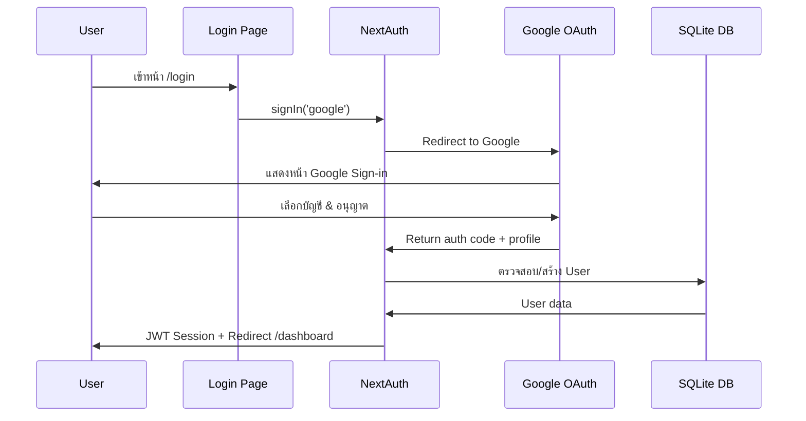
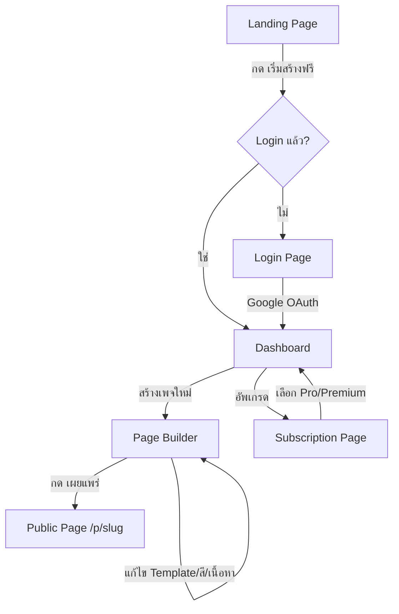

# Sale Page Builder — Mockup & Google Authentication

> SaaS Platform สำหรับสร้าง Sale Page แบบมืออาชีพ พร้อม Google OAuth Authentication

---

## 🏗️ Tech Stack

| เทคโนโลยี | รายละเอียด |
|-----------|-----------|
| **Framework** | Next.js 16.1.6 (App Router + Turbopack) |
| **Language** | TypeScript |
| **Styling** | Tailwind CSS v4 |
| **Auth** | NextAuth.js v4 + Google OAuth 2.0 |
| **Database** | SQLite (via better-sqlite3) |
| **ORM** | Prisma 7 |
| **Icons** | Lucide React |
| **Font** | Inter (Google Fonts) |

---

## 🔐 Google Authentication Flow



### การตั้งค่า Auth (auth.ts)

- **Provider**: Google OAuth 2.0
- **Session Strategy**: JWT (ไม่ต้องเก็บ session ใน DB)
- **Callbacks**:
  - `signIn` → ตรวจสอบ/สร้าง User ใน DB
  - `session` → เพิ่ม user ID เข้า session
  - `jwt` → เก็บ user ID ใน token
- **Custom Pages**: Login redirect ไปหน้า `/login`

### Environment Variables ที่ต้องตั้งค่า
```env
GOOGLE_CLIENT_ID=your_google_client_id
GOOGLE_CLIENT_SECRET=your_google_client_secret
NEXTAUTH_SECRET=your_secret_key
NEXTAUTH_URL=http://localhost:3000
```

---

## 📄 หน้าทั้งหมดในระบบ

### 1. Landing Page (`/`)
- Hero section พร้อม CTA "เริ่มสร้างฟรี"
- Features: 3 เทมเพลท, 10+ สี, Hosting ฟรี
- Pricing: Free / Pro ฿199 / Premium ฿299
- Footer

### 2. Login Page (`/login`)
- ปุ่ม "เข้าสู่ระบบด้วย Google" พร้อม Google icon
- Auto-redirect ไป Dashboard ถ้า login แล้ว
- Glassmorphism design + gradient background

### 3. Dashboard (`/dashboard`)
- แสดงสถานะ Subscription (Free/Pro/Premium)
- จำนวนวันที่เหลือ (Free trial 14 วัน)
- รายการ Sale Pages ที่สร้าง (CRUD)
- ปุ่มสร้างเพจใหม่ / ลบ / แก้ไข / ดูเพจ
- แสดง Google profile (รูป + ชื่อ)

### 4. Page Builder (`/dashboard/builder/[pageId]`)
- **Sidebar Navigation**: 10 sections (เทมเพลท, สี, Navbar, Hero, ตัวเลข, คุณค่า, บริการ, รีวิว, CTA, ติดต่อ)
- **Editor Panel**: แก้ไขเนื้อหาแต่ละ section
- **Live Preview**: แสดงผลเทมเพลทแบบ real-time
- **Auto-save**: บันทึกอัตโนมัติทุก 1.5 วินาทีหลังแก้ไข
- **เผยแพร่**: สร้าง public URL สำหรับ sale page

### 5. Subscription Page (`/dashboard/subscription`)
- เลือกอัพเกรดเป็น Pro หรือ Premium
- Mock payment (ยังไม่มี payment gateway จริง)

### 6. Public Sale Page (`/p/[slug]`)
- Server-side rendered
- แสดง sale page ตาม template/config ที่เลือก
- SEO metadata จาก config

---

## 🗄️ Database Schema

```mermaid
erDiagram
    User ||--o{ Account : has
    User ||--o{ Session : has
    User ||--o{ Page : creates
    User ||--o| Subscription : has
    Page ||--o| CustomDomain : has

    User {
        string id PK
        string name
        string email UK
        string image
        datetime createdAt
    }

    Page {
        string id PK
        string userId FK
        string slug UK
        string title
        string template
        string config
        string colorTheme
        boolean isPublished
        datetime createdAt
        datetime updatedAt
    }

    Subscription {
        string id PK
        string userId FK_UK
        string tier
        datetime startDate
        datetime endDate
        boolean isActive
    }

    CustomDomain {
        string id PK
        string pageId FK_UK
        string domain UK
        boolean isVerified
    }
```

---

## 💰 Subscription Tiers

| Feature | Free | Pro ฿199/เดือน | Premium ฿299/เดือน |
|---------|:----:|:--------------:|:------------------:|
| ใช้งานเทมเพลท | 1 | ทั้งหมด (3) | ทั้งหมด (3) |
| ระยะเวลา | 14 วัน | ไม่จำกัด | ไม่จำกัด |
| Hosting | Subdomain | Subdomain | Custom Domain |
| Brand Colors | ❌ | ✅ | ✅ |
| Content Presets | ❌ | ✅ | ✅ |
| Priority Support | ❌ | ❌ | ✅ |
| ลายน้ำ | มี | มี | ไม่มี |

---

## 🎨 Templates & Presets

### 3 เทมเพลท
1. **Professional** — สไตล์ Karnwealth (ธุรกิจ, เรียบหรู)
2. **Premium** — สไตล์ Apple (โมเดิร์น, มินิมอล)
3. **Minimal** — สะอาด เรียบง่าย

### Content Presets
- 💰 **นักวางแผนการเงิน** — เนื้อหาสำเร็จรูปสำหรับที่ปรึกษาการเงิน/ประกัน
- 🏠 **นายหน้าอสังหา** — เนื้อหาสำเร็จรูปสำหรับนายหน้าอสังหาริมทรัพย์
- ✏️ **กำหนดเอง** — เริ่มต้นจากเนื้อหาว่าง

### Brand Color Presets
สี 10+ แบรนด์บริษัทประกันชั้นนำ: AIA, FWD, ไทยประกัน และอื่นๆ

---

## 📁 โครงสร้างไฟล์หลัก

```
src/
├── app/
│   ├── page.tsx                      # Landing Page
│   ├── layout.tsx                    # Root Layout + Font
│   ├── globals.css                   # Global Styles + Animations
│   ├── login/page.tsx                # Google Login Page
│   ├── dashboard/
│   │   ├── page.tsx                  # Dashboard (Page List)
│   │   ├── builder/[pageId]/page.tsx # Page Builder Editor
│   │   └── subscription/page.tsx     # Upgrade Plans
│   ├── p/[slug]/page.tsx             # Public Sale Page (SSR)
│   └── api/
│       ├── auth/[...nextauth]/route.ts  # NextAuth API
│       ├── pages/route.ts               # Pages CRUD
│       ├── pages/[id]/route.ts          # Single Page API
│       ├── subscription/route.ts        # Subscription API
│       └── custom-domain/route.ts       # Custom Domain API
├── components/
│   ├── providers.tsx                 # SessionProvider
│   └── templates/
│       ├── professional.tsx          # Professional Template
│       ├── premium.tsx               # Premium Template
│       └── minimal.tsx               # Minimal Template
├── lib/
│   ├── auth.ts                       # NextAuth Config
│   ├── db.ts                         # Database Layer (SQLite)
│   ├── types.ts                      # TypeScript Types
│   └── presets/
│       ├── colors.ts                 # Color Theme Presets
│       └── content.ts               # Content Presets
└── middleware.ts                     # Auth Middleware
```

---

## 🔄 User Flow



---

## 🚀 วิธีรันโปรเจกต์

```bash
# 1. ติดตั้ง dependencies
npm install

# 2. ตั้งค่า .env (ใส่ Google OAuth credentials)
cp .env.example .env

# 3. สร้าง Database
npx prisma db push

# 4. รัน Development Server
npm run dev

# เปิดเบราว์เซอร์ http://localhost:3000
```

---

## 📋 สถานะปัจจุบัน

| ฟีเจอร์ | สถานะ |
|---------|-------|
| Landing Page | ✅ เสร็จ |
| Google OAuth Login | ✅ เสร็จ |
| Dashboard (CRUD Pages) | ✅ เสร็จ |
| Page Builder (Real-time) | ✅ เสร็จ |
| 3 Templates | ✅ เสร็จ |
| Auto-save | ✅ เสร็จ |
| Public Page Hosting | ✅ เสร็จ |
| Subscription System | ✅ เสร็จ (Mock) |
| Brand Color Presets | ✅ เสร็จ |
| Content Presets | ✅ เสร็จ |
| Custom Domain | 🔧 API เสร็จ, UI ยังไม่มี |
| Payment Gateway | ⏳ ยังไม่ integrate |
| Responsive Mobile | ⏳ บางส่วน |
